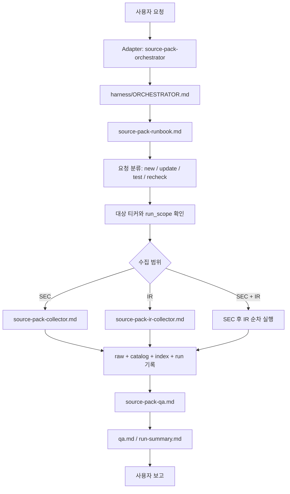
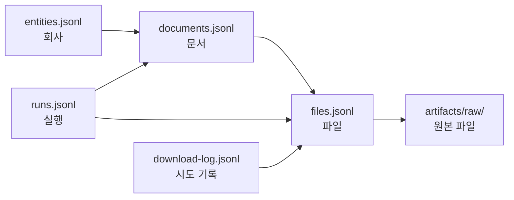
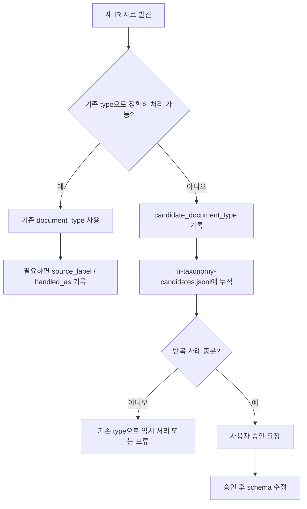

# P2-S03 Source Pack Architecture Map

- 작성일: 2026-06-06
- 대상 하네스: P2-S03 Source Pack
- 문서 목적: 비개발자 운영자가 Source Pack의 전체 구조, 실행 흐름, 핵심 기능, 위험 지점, 확장 지점을 이해할 수 있게 정리한다.
- 문서 성격: 초보자용 아키텍처 지도. 실제 실행 규칙의 최종 원본은 `harness/`다.

이 문서는 투자 분석이 아니다.
이 문서는 Source Pack이라는 수집형 하네스가 어떤 부품으로 되어 있고, 사용자의 요청이 들어오면 어떤 순서로 움직이는지 설명하는 운영자용 지도다.

## 1. 한 줄 정의

Source Pack은 아래 일을 하는 하네스다.

```text
SEC 공시, 회사 공식 IR 자료, 가능한 경우 transcript 원문을
raw 파일과 catalog 원장으로 정리해서
다음 가치투자 하네스가 믿고 읽을 수 있는 원자료 패키지를 만든다.
```

가장 중요한 점:

```text
Source Pack은 분석하지 않는다.
Source Pack은 원자료를 모으고, 저장하고, 검증하고, 다음 하네스가 읽을 수 있게 정리한다.
```

비유하면:

| 비유 | Source Pack에서의 의미 |
|---|---|
| 도서관 사서 | 자료를 찾아서 정확한 서가에 꽂는다 |
| 창고 관리자 | 원본 파일이 어디 있는지, 손상되지 않았는지 관리한다 |
| 출처 기록 담당자 | 자료가 SEC인지, 회사 IR인지, 언제 받았는지 남긴다 |
| 검수 담당자 | 파일이 실제로 있고 catalog와 연결되는지 확인한다 |

## 2. 하지 않는 일

Source Pack은 아래 일을 하지 않는다.

- 투자 thesis 작성
- valuation
- 매수/매도/보유 의견
- 재무제표 해석
- 사업 분석
- 경쟁 분석
- IR 자료 요약/번역
- transcript 생성/요약
- 로그인, 유료벽, 봇 차단 우회

이 구분이 중요하다.

```text
Source Pack이 하는 일: "자료가 어디 있고 믿을 수 있는가?"
다음 분석 하네스가 하는 일: "이 자료가 무슨 의미인가?"
```

## 3. 전체 구조를 보는 가장 큰 지도

Source Pack은 크게 다섯 덩어리로 나뉜다.

```text
사용자 요청
  ↓
Adapter(.agents / .claude)
  ↓
공통 실행 원장(harness/)
  ↓
산출물 저장소(artifacts/)
  ↓
설계/인계 문서(docs/)
```

각 덩어리의 역할:

| 덩어리 | 위치 | 쉬운 설명 |
|---|---|---|
| 사용자 요청 | 채팅창 | "AAPL SEC 자료 수집해줘" 같은 자연어 요청 |
| Adapter | `.agents/`, `.claude/` | Codex와 Claude Code가 이 프로젝트에 접속하는 얇은 입구 |
| 공통 실행 원장 | `harness/` | 두 AI가 같이 따라야 하는 진짜 업무 규칙 |
| 산출물 저장소 | `artifacts/` | raw 파일, catalog, 회사별 index, run 기록 |
| 설계/인계 문서 | `docs/` | 왜 이렇게 설계했는지, 현재 상태가 어떤지 설명하는 문서 |

핵심 원칙:

```text
업무 의미는 harness/에 둔다.
Codex와 Claude Code는 각자 adapter만 얇게 둔다.
```

이 구조 덕분에 Codex와 Claude Code가 서로 다른 도구여도 같은 업무 규칙을 따라갈 수 있다.

## 4. 요청이 들어왔을 때 실제 흐름

아래는 사용자가 "APP IR 자료 수집해줘" 같은 요청을 했을 때의 큰 흐름이다.



초보자용으로 풀면:

1. 사용자가 자연어로 요청한다.
2. adapter가 "이건 Source Pack 일이구나"라고 알아본다.
3. `harness/`의 공통 절차를 읽는다.
4. SEC를 할지, IR을 할지, 테스트인지, 운영 반영인지 판단한다.
5. 수집한다.
6. raw 파일과 catalog 원장을 남긴다.
7. QA로 검증한다.
8. 사용자에게 성공/실패/확인 필요를 보고한다.

## 5. 폴더 구조 지도

현재 Source Pack에서 가장 중요한 폴더는 아래다.

| 폴더 | 역할 | 건드릴 때 주의 |
|---|---|---|
| `harness/` | 실제 실행 규칙 | 가장 중요. 업무 의미를 바꾸는 곳 |
| `.agents/` | Codex adapter | Codex 진입 방식만 얇게 둔다 |
| `.claude/` | Claude Code adapter | Claude Code 진입 방식만 얇게 둔다 |
| `artifacts/catalog/` | 기계용 원장 | 다음 하네스가 읽는 핵심 데이터 |
| `artifacts/companies/` | 회사별 사람용 index | 사람이 자료 지도를 읽는 곳 |
| `artifacts/runs/` | 실행별 기록 | 실패/QA/다운로드 로그 추적 |
| `artifacts/raw/` | 원자료 파일 | 대용량, git 제외, 함부로 삭제 금지 |
| `artifacts/derived/` | 원문에서 추출한 text | raw에서 파생된 보조 자료 |
| `docs/current/` | 현재 상태와 큰 지도 | 새 세션의 진입점 |
| `docs/design/` | 설계 결정과 기준 | 왜 그렇게 만들었는지 |
| `docs/pilots/` | preflight/pilot 기록 | 실제 테스트 증거 |
| `docs/templates/` | 재사용 템플릿 | 관측 가능성, 공용 하네스 템플릿 |
| `docs/handoff/` | 과거 인계 문서 | 역사 기록. 최신 상태와 다를 수 있음 |
| `docs/reference/` | PDF 참고자료 | 배경 지식 |

## 6. `harness/` 안의 핵심 부품

`harness/`는 이 하네스의 심장이다.

| 파일 | 쉬운 역할 | 더 정확한 역할 |
|---|---|---|
| `harness/ORCHESTRATOR.md` | 전체 지휘서 | 실행 모드, 승인 조건, 중단 조건, 금지사항 |
| `harness/MANIFEST.md` | 파일 지도 | 어떤 파일이 어떤 역할인지 설명 |
| `harness/contracts/source-pack.contract.md` | 계약서 | 목표, 입력, 출력, 완료 기준 |
| `harness/procedures/source-pack-runbook.md` | 실제 진행표 | 한 번 실행할 때의 순서 |
| `harness/procedures/source-pack-collector.md` | SEC 수집 절차 | SEC EDGAR 중심 수집 |
| `harness/procedures/source-pack-ir-collector.md` | IR 수집 절차 | 회사 공식 IR/Newsroom 자료 수집 |
| `harness/procedures/source-pack-qa.md` | 검수 절차 | catalog, raw, index, run 검증 |
| `harness/schemas/source-pack-catalog.schema.md` | 원장 형식 | entities/documents/files/runs schema |
| `harness/schemas/source-pack-index.schema.md` | 회사별 index 형식 | 사람용 index.md 구조 |
| `harness/schemas/source-pack-run-summary.schema.md` | 실행 요약 형식 | run-summary.md 구조 |
| `harness/rubrics/source-pack-qa.rubric.md` | 평가 기준표 | QA 품질 기준 |

## 7. Adapter와 공통 원장의 관계

Codex와 Claude Code는 서로 다른 실행 환경이다.
그래서 각자 adapter가 있다.

```text
Codex adapter: .agents/
Claude Code adapter: .claude/
공통 업무 규칙: harness/
```

원칙:

- 공통 업무 규칙은 `harness/`에 둔다.
- Codex만의 실행 방식은 `.agents/`에 둔다.
- Claude Code만의 실행 방식은 `.claude/`에 둔다.
- 같은 업무 규칙을 adapter에 길게 복사하지 않는다.

비유:

```text
harness/ = 회사의 업무 매뉴얼
.agents/ = Codex 직원의 출입증과 사용법
.claude/ = Claude Code 직원의 출입증과 사용법
```

이 구조를 택한 이유:

- 한쪽 AI에만 맞춘 규칙이 되지 않게 한다.
- Codex와 Claude Code 결과를 비교할 수 있다.
- 업무 규칙이 흩어지는 것을 막는다.

## 8. 실행 모드 지도

Source Pack은 모든 요청을 같은 방식으로 처리하지 않는다.
먼저 실행 모드를 나눈다.

| 실행 모드 | 의미 | 예시 |
|---|---|---|
| `new_collection` | 새 회사/새 자료 수집 | "AAPL source pack 만들어줘" |
| `incremental_update` | 기존 원장에 새 자료만 추가 | "AAPL 업데이트해줘" |
| `partial_recheck` | 특정 영역만 다시 확인 | "APP IR overlap만 다시 확인해줘" |
| `test_collection` | 제한된 테스트 실행 | "TEM IR 3건만 pilot으로 실행해줘" |
| `comparison` | Codex/Claude 결과 비교 | "Claude Codex 비교해줘" |

중요:

```text
test_collection은 운영 catalog 반영이 아니다.
운영 catalog/index에 반영하려면 사용자 승인이 필요하다.
```

## 9. 산출물 지도: raw, catalog, index, runs

Source Pack이 만든 결과는 크게 네 종류다.

### 9.1 raw

위치:

```text
artifacts/raw/
```

뜻:

```text
실제 원본 파일 저장소
```

예:

- SEC HTML
- SEC exhibit
- IR PDF
- IR HTML

주의:

- 대용량이라 git 제외 대상이다.
- 함부로 삭제하면 catalog와 연결이 깨질 수 있다.
- 보안 제품이 격리한 파일은 복구하거나 열지 않는다.

### 9.2 catalog

위치:

```text
artifacts/catalog/
```

뜻:

```text
기계가 읽는 원장
```

주요 파일:

| 파일 | 역할 |
|---|---|
| `entities.jsonl` | 회사/티커/CIK 같은 회사 정보 |
| `documents.jsonl` | 어떤 문서가 있는지 |
| `files.jsonl` | 문서에 연결된 실제 파일 정보 |
| `runs.jsonl` | 실행 기록 요약 |
| `ir-taxonomy-candidates.jsonl` | 새 IR type 후보 관찰 원장 |

비유:

```text
raw가 창고에 있는 실제 상자라면,
catalog는 그 상자가 몇 번 선반에 있는지 적은 창고 관리 장부다.
```

### 9.3 company index

위치:

```text
artifacts/companies/{TICKER}/index.md
```

뜻:

```text
사람이 읽는 회사별 원자료 지도
```

예:

```text
artifacts/companies/APP/index.md
artifacts/companies/AAPL/index.md
```

### 9.4 runs

위치:

```text
artifacts/runs/{run-id}/
```

뜻:

```text
각 실행의 블랙박스 기록
```

주요 파일:

| 파일 | 역할 |
|---|---|
| `download-log.jsonl` | 실제 다운로드 시도 기록 |
| `run-summary.md` | 실행 결과 요약 |
| `qa.md` | QA 결과 |

문제가 생기면 보통 여기부터 본다.

## 10. 데이터 관계 지도

catalog의 핵심 관계는 아래다.



쉬운 설명:

- `entities`: 어느 회사인가
- `documents`: 어떤 문서인가
- `files`: 그 문서의 실제 파일은 무엇인가
- `raw`: 파일의 실제 위치
- `runs`: 언제 어떤 실행에서 수집했는가
- `download-log`: 다운로드가 어떻게 성공/실패했는가

## 11. SEC 수집과 IR 수집의 차이

Source Pack에는 source가 여러 종류 있다.
현재 핵심은 SEC와 IR이다.

| 항목 | SEC | Company IR |
|---|---|---|
| 주 출처 | SEC EDGAR | 회사 공식 IR/Newsroom |
| 구조화 정도 | 높음 | 회사마다 다름 |
| 고유 ID | accession number 있음 | 공식 고유 ID가 거의 없음 |
| collector | `source-pack-collector.md` | `source-pack-ir-collector.md` |
| document_id | SEC accession 기반 | 의미 기반으로 생성 |
| taxonomy | SEC form 중심 | controlled but extensible |
| 중복 가능성 | IR과 겹칠 수 있음 | SEC 8-K/EX-99.1과 겹칠 수 있음 |

핵심:

```text
SEC는 비교적 표준화된 도로다.
IR은 회사마다 길 모양이 다르다.
그래서 IR은 preflight와 candidate 기록이 중요하다.
```

## 12. IR taxonomy 기능

IR 자료는 회사마다 이름이 다르다.
그래서 Source Pack은 IR type을 무작정 많이 만들지 않았다.

현재 active IR `document_type`:

| document_type | 뜻 |
|---|---|
| `ir-earnings-release` | 공식 실적 발표 자료 |
| `ir-financial-supplement` | 실적 관련 재무 보충자료 |
| `ir-deck` | IR presentation류를 넓게 담는 type |

핵심 원칙:

```text
controlled but extensible vocabulary
```

쉬운 뜻:

```text
아무 이름이나 막 쓰지는 않는다.
하지만 새 자료 유형이 반복해서 나오면 확장할 수 있다.
```

새 IR 유형이 나왔을 때 흐름:



중요 사례:

| 사례 | 처리 |
|---|---|
| APP `Financial Update` | 새 type 아님. `source_label: Financial Update; handled_as: ir-financial-supplement` |
| TEM Corporate Deck | `ir-earnings-presentation` 후보로 원장 기록, 현재는 `ir-deck` |

## 13. SEC-IR overlap 기능

SEC와 IR에는 같은 실적자료가 중복으로 올라올 수 있다.

예:

- SEC 8-K EX-99.1에 실적 발표 자료가 있음
- 회사 IR 사이트에도 같은 실적 발표 자료가 있음

문제:

```text
같은 자료를 두 번 저장할 것인가?
한쪽만 저장할 것인가?
둘이 비슷하지만 실제 파일이 다르면 어떻게 할 것인가?
```

현재 원칙:

- 파일 내용 동일성은 SHA-256 hash로 판단한다.
- hash가 같으면 같은 파일로 본다.
- hash가 다르면 의미상 비슷해도 다른 raw로 보관할 수 있다.
- SEC form 자체는 SEC EDGAR가 canonical이다.
- IR-native 자료는 Company IR이 canonical이다.
- 현재는 별도 관계 원장 없이 `notes`에 상태를 기록한다.

주요 상태:

| 상태 | 뜻 |
|---|---|
| `same_hash_as_sec` | SEC 파일과 완전히 같은 파일 |
| `different_hash_from_sec_candidate` | 의미상 SEC 후보와 겹치지만 파일 hash는 다름 |
| `sec_equivalent_not_found_in_scoped_8k` | 제한 확인한 SEC 8-K 안에 대응 exhibit 없음 |
| `not_found_in_local_catalog` | 현재 로컬 catalog 안에서는 SEC 후보를 못 찾음 |
| `security_quarantined` | 보안 제품이 파일을 격리/삭제 |
| `raw_missing_repair_required` | catalog에는 있는데 실제 raw 파일이 없음 |

중요:

```text
not_found_in_local_catalog는 "중복 없음 확정"이 아니다.
현재 가진 로컬 자료 안에서 못 찾았다는 뜻이다.
```

## 14. 관측 가능성 기능

관측 가능성은 하네스 자체를 나중에 가볍게 만들기 위한 메모 장치다.

현재 run-summary에 선택적으로 아래를 남길 수 있다.

```text
## 하네스 운영 관찰
- instructions_files_consulted
- instructions_lines_consulted_estimate
- bottleneck_note
- trim_candidate
```

현재 상태:

- schema와 runbook에 선택 섹션으로 반영됐다.
- QA 필수 조건이 아니다.
- 자동 측정 스크립트는 없다.
- 누락돼도 실패가 아니다.

쉬운 뜻:

```text
매번 어디서 시간이 많이 걸렸는지 가볍게 메모해두는 장치다.
아직 Datadog 같은 자동 모니터링 시스템은 아니다.
```

## 15. 오류 감지와 QA 구조

Source Pack은 실패를 숨기지 않고 기록하는 쪽으로 설계됐다.

오류를 찾는 주요 위치:

| 위치 | 무엇을 확인하나 |
|---|---|
| `download-log.jsonl` | 다운로드 시도별 성공/실패 |
| `run-summary.md` | 실행 결과와 확인 필요 항목 |
| `qa.md` | 표준 QA 결과 |
| `documents.jsonl` | 문서 상태와 notes |
| `files.jsonl` | 파일 경로, size, hash |
| 회사별 `index.md` | 사람이 읽는 상태 요약 |

실패 상태 예:

| 상태 | 의미 |
|---|---|
| `pass` | 검증 통과 |
| `partial_pass` | 일부 제한/확인 필요가 있지만 핵심은 사용 가능 |
| `unverified` | 검증 부족 |
| `fail` | 후속 사용 위험 |
| `stopped` | 실행 조건 문제로 중단 |
| `repair_required` | 기존 기록과 실제 파일이 맞지 않음 |

중요:

```text
실패 자체보다 위험한 것은 실패를 기록하지 않는 것이다.
Source Pack은 실패를 기록으로 남겨 다음 사람이 판단할 수 있게 한다.
```

## 16. 보안 격리 파일 처리

NTRA IR pilot에서 Bitdefender가 PDF 파일을 격리한 실제 사건이 있었다.

이 사건으로 정한 원칙:

```text
보안 제품이 격리한 파일은 복구하지 않는다.
열지 않는다.
운영 catalog/index에 승격하지 않는다.
사용자 승인과 별도 보안 검토 전까지 재시도하지 않는다.
```

이건 Source Pack에서 중요한 안전장치다.

비개발자 관점에서 기억할 한 문장:

```text
백신 프로그램이 위험하다고 막은 파일은 AI가 호기심으로 열어보면 안 된다.
```

## 17. 사람 승인이 필요한 지점

Source Pack은 모든 것을 자동으로 결정하지 않는다.
아래는 사람 승인이 필요한 영역이다.

| 상황 | 왜 승인이 필요한가 |
---|---|
| 운영 catalog/index 반영 | 다음 하네스 입력이 바뀌기 때문 |
| 비교 모드 결과 병합 | 두 모델 결과 중 무엇을 믿을지 결정해야 함 |
| 새 IR document_type 추가 | schema가 바뀌기 때문 |
| 보안 격리 파일 재시도/복구 | 보안 위험이 있기 때문 |
| transcript 유료벽/로그인/차단 우회 | 정책/법적/보안 문제가 있을 수 있음 |
| raw/catalog 구조 변경 | 기존 자료와 다음 하네스가 깨질 수 있음 |

좋은 운영 원칙:

```text
수집은 AI가 도와도,
운영 원장에 반영하거나 schema를 바꾸는 결정은 사용자가 승인한다.
```

## 18. 현재 구현된 것과 보류한 것

| 영역 | 현재 상태 |
|---|---|
| SEC 수집 | 기본 구조 있음 |
| IR 수집 | v1 최소 운영 구조 있음 |
| IR taxonomy | active type 3개 + 후보 원장 |
| SEC-IR overlap | notes 기반 최소 절차 |
| 관측 가능성 | run-summary 선택 섹션 |
| 보안 격리 처리 | IR collector 절차에 반영 |
| QA | 표준 절차와 rubric 있음 |
| relationship 원장 | 보류 |
| source-observations 원장 | 보류 |
| 정기 integrity audit 스크립트 | 보류 |
| 자동 observability 측정 도구 | 보류 |
| transcript/audio 전용 수집 | 보류 |

왜 보류했는가:

```text
아직 운영 사례가 적다.
지금 너무 많이 자동화하면 실제 문제가 아니라 상상한 문제에 맞춰 구조가 커진다.
```

## 19. 위험 지점 지도

아래 파일이나 폴더는 조심해서 다룬다.

| 위치 | 위험 |
|---|---|
| `harness/schemas/source-pack-catalog.schema.md` | catalog 구조가 바뀌면 다음 하네스가 깨질 수 있음 |
| `harness/procedures/source-pack-runbook.md` | 실행 흐름과 승인 조건이 바뀜 |
| `harness/procedures/source-pack-collector.md` | SEC 수집 안정성에 영향 |
| `harness/procedures/source-pack-ir-collector.md` | IR 수집과 overlap/taxonomy에 영향 |
| `artifacts/catalog/*.jsonl` | 기계용 원장. 잘못 바꾸면 자료 관계가 깨짐 |
| `artifacts/raw/` | 실제 원자료. 삭제하면 복구가 어려울 수 있음 |
| `artifacts/companies/{TICKER}/index.md` | 사람이 읽는 회사별 지도 |

안전한 수정 순서:

1. 먼저 `docs/`에 설계 메모를 쓴다.
2. 작은 pilot으로 검증한다.
3. 사용자 승인 후 `harness/` 또는 catalog에 반영한다.
4. QA를 실행한다.
5. 문제가 반복될 때만 구조를 키운다.

## 20. 확장 지점 지도

앞으로 기능을 추가할 때는 아래 위치를 본다.

| 하고 싶은 일 | 먼저 볼 곳 | 실제 수정 후보 |
|---|---|---|
| 새 IR type 추가 | `ir-taxonomy-candidates.jsonl`, taxonomy checkpoint | `source-pack-catalog.schema.md`, `source-pack-ir-collector.md` |
| IR 절차 보강 | IR pilot 결과, postmortem | `source-pack-ir-collector.md` |
| SEC 수집 보강 | SEC run 실패 기록 | `source-pack-collector.md` |
| overlap 자동화 | dedup 설계 문서, APP 사례 | 새 관계 원장 또는 QA 도구 |
| 관측 자동화 | run-summary 운영 관찰 | 작은 line-count/metric 도구 |
| QA 강화 | 실패한 `qa.md` | `source-pack-qa.md`, QA rubric |
| 다음 하네스 연결 | artifacts catalog/index | 다음 하네스의 입력 계약 |

## 21. 실제 사용할 때의 읽기 순서

비개발자 운영자가 현재 상태를 이해하려면 아래 순서로 읽으면 된다.

1. `docs/current/source-pack-architecture-map-2026-06-06.md`
2. `docs/current/source-pack-ir-v1-closeout-2026-06-05.md`
3. `docs/current/source-pack-ir-current-state-map-2026-06-05.md`
4. 필요할 때만 `harness/procedures/source-pack-runbook.md`
5. IR 작업이면 `harness/procedures/source-pack-ir-collector.md`
6. 중복/무결성 논의면 `docs/design/sec-ir-deduplication-and-integrity-design-2026-06-05.md`

## 22. 요청 문구 예시

### 22.1 새 IR preflight

```text
{TICKER} 공식 IR 사이트만 대상으로 IR preflight 메모를 작성해줘.

조건:
- 다운로드하지 말 것
- catalog/index/raw 수정하지 말 것
- 기존 document_type으로 처리 가능한 자료와 candidate_document_type 후보를 구분할 것
- SEC overlap 가능성이 있는 earnings-related 자료와 IR-native 자료를 구분할 것
- pilot 후보 1~3건을 제안할 것
```

### 22.2 제한 pilot

```text
{TICKER} IR pilot을 test_collection으로 실행해줘.

조건:
- 승인한 자료만 run-local로 저장
- 운영 catalog/index는 사용자 승인 없이 수정하지 말 것
- SEC 다운로드는 하지 말 것
- PDF는 local_path, hash, 보안 격리 여부를 QA할 것
```

### 22.3 운영 반영

```text
{TICKER} IR pilot raw를 운영 catalog/index에 반영해줘.

조건:
- 대상 raw만 반영
- notes에 SEC overlap 상태를 남길 것
- 반영 후 QA를 실행할 것
```

### 22.4 구조 수정 논의

```text
Source Pack 구조를 수정하기 전에 먼저 설계 메모를 작성해줘.

목표:
- 현재 문제
- 가능한 선택지
- 하네스 안정성 영향
- 수정해야 할 파일
- 보류 가능한 것
- 추천안
```

## 23. 초보자용 핵심 용어

| 용어 | 쉬운 뜻 |
|---|---|
| Harness | AI가 반복 업무를 안전하게 수행하도록 만든 작업 환경 |
| Adapter | Codex/Claude Code가 하네스에 들어오는 입구 |
| Runbook | 한 번 실행할 때 따라가는 순서표 |
| Collector | 자료를 실제로 수집하는 절차 |
| QA | 수집 결과를 검수하는 절차 |
| Schema | 원장에 어떤 항목을 어떤 형식으로 적을지 정한 약속 |
| Catalog | 기계가 읽는 자료 원장 |
| Index | 사람이 읽는 회사별 자료 지도 |
| Raw | 원본 파일 |
| Run | 한 번의 실행 기록 |
| Preflight | 실제 다운로드 전에 사이트와 후보 자료를 미리 살피는 일 |
| Pilot | 제한 범위 테스트 수집 |
| Taxonomy | 자료 유형 분류 체계 |
| Candidate | 아직 정식 분류로 확정하지 않은 후보 |
| Overlap | SEC와 IR에 같은/비슷한 자료가 겹치는 현상 |
| Integrity | catalog 기록과 실제 파일이 맞는지 확인하는 무결성 |
| Observability | 하네스가 어디서 오래 걸리고 복잡해지는지 관찰하는 장치 |

## 24. 이 하네스를 이해하는 가장 짧은 버전

정말 짧게 외우면 아래다.

```text
1. 사용자는 자연어로 요청한다.
2. adapter가 Source Pack으로 라우팅한다.
3. harness가 공통 규칙을 제공한다.
4. collector가 SEC/IR 원자료를 모은다.
5. raw는 실제 파일, catalog는 기계용 원장, index는 사람용 지도다.
6. QA가 파일과 원장 관계를 확인한다.
7. 새 분류나 운영 반영처럼 위험한 결정은 사용자 승인을 받는다.
8. 실패와 애매함은 숨기지 않고 notes, download-log, qa에 남긴다.
```

## 25. 결론

P2-S03 Source Pack은 현재 아래 상태다.

```text
SEC + IR 원자료 수집을 위한 v1 구조는 작동한다.
IR taxonomy, SEC-IR overlap, 관측 가능성, 보안 격리 처리도 최소 구조가 들어갔다.
하지만 대규모 자동 운영 시스템은 아직 아니다.
앞으로는 실제 사용 중 반복되는 문제를 근거로만 작게 확장한다.
```

이 문서는 그 구조를 이해하기 위한 큰 지도다.
실제 실행 규칙은 항상 `harness/`를 우선한다.
